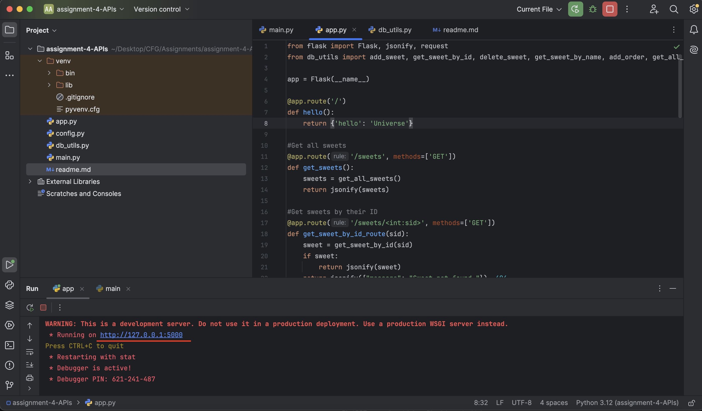
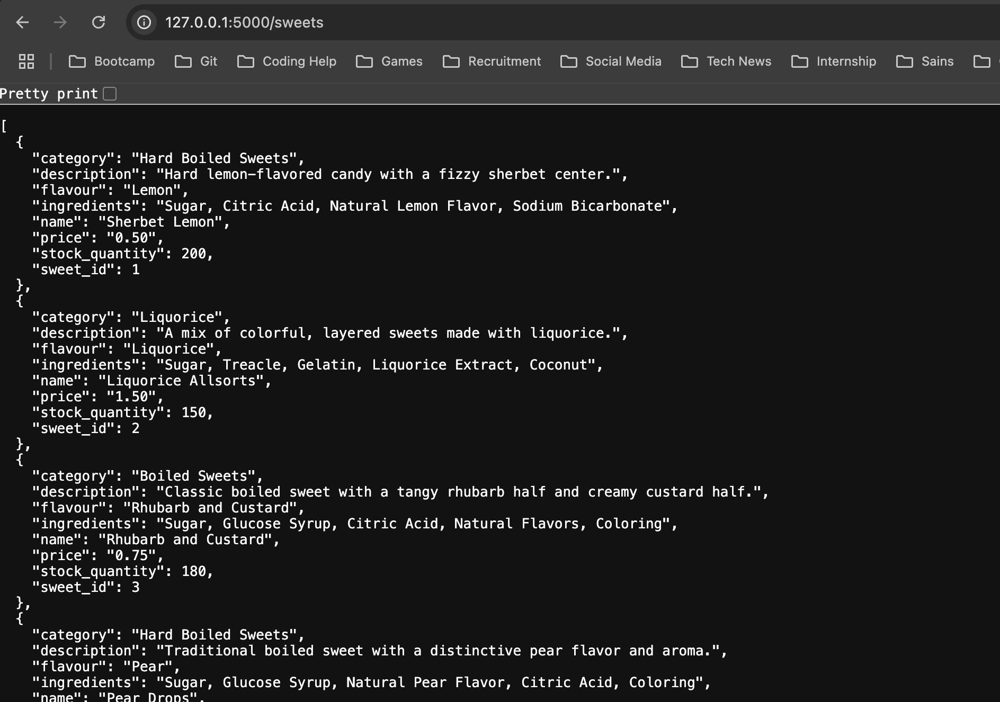
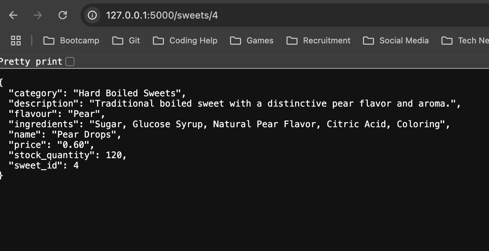
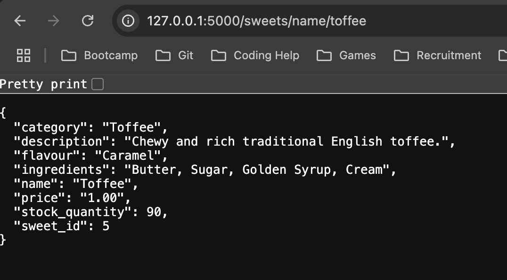
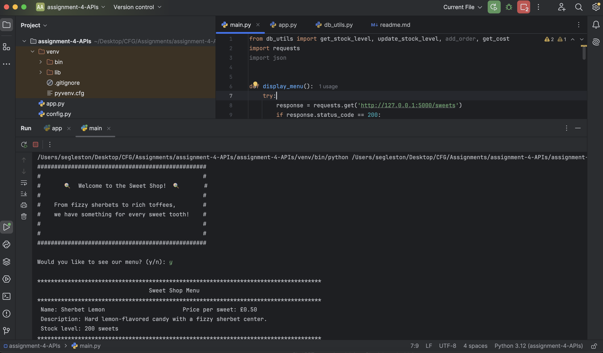
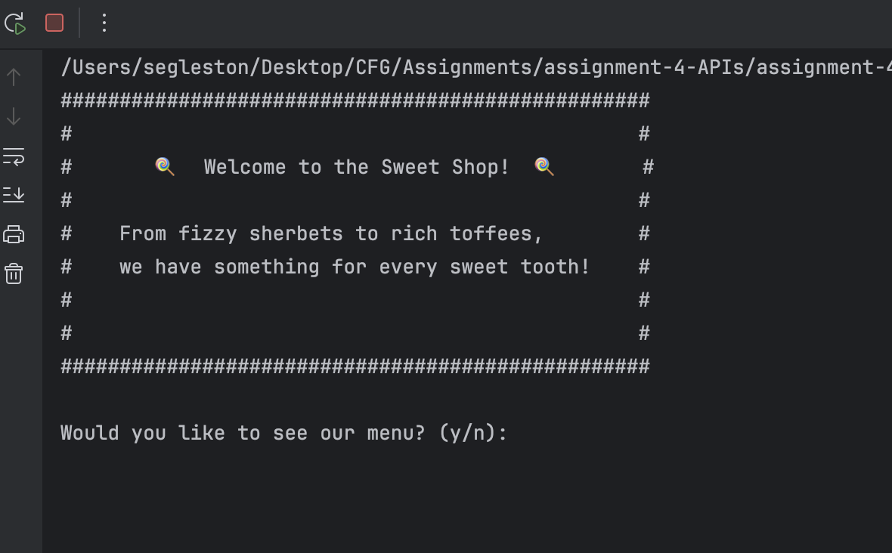
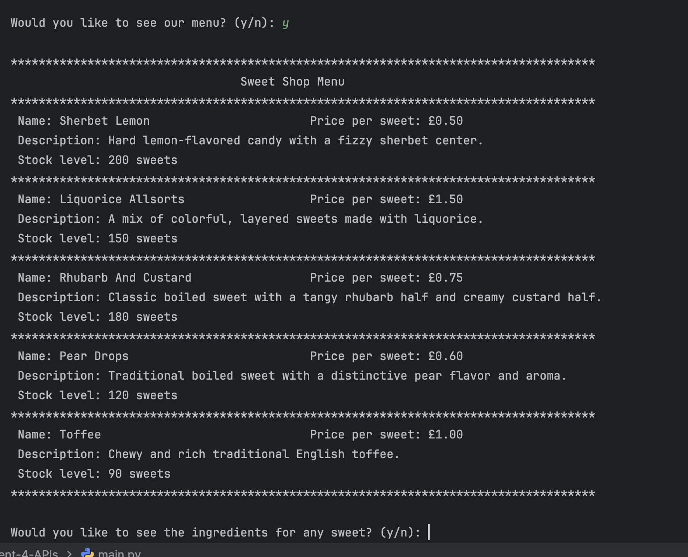
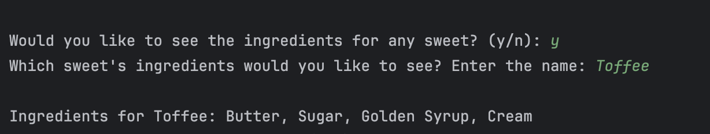

# Sweet Shop API

Welcome to the Sweet Shop API project! This is a Flask-based RESTful API that allows users to interact with a sweet shop, manage inventory, and place orders.

## Table of Contents

- [Installation Requirements](#installation-requirements)
- [Setting Up the MySQL Database](#setting-up-the-mysql-database)
- [Running the Flask App](#running-the-flask-app)
- [API Endpoints](#api-endpoints)

## Installation Requirements

Before you begin, ensure you have the following installed on your machine:

- Python 3.7 or higher
- MySQL Server
- pip (Python package installer)

## Setting up the mysql database 

1. Create a MySQL Database: Open your MySQL client and create a new database and tables:

```commandline
CREATE DATABASE sweet_shop;

USE sweet_shop;

CREATE TABLE sweets (
    sweet_id INT AUTO_INCREMENT PRIMARY KEY,
    name VARCHAR(100) NOT NULL,
    price DECIMAL(10, 2) NOT NULL,
    description TEXT,
    stock_quantity INT NOT NULL,
    category VARCHAR(50),
    flavour VARCHAR(50),
    ingredients TEXT
);

CREATE TABLE orders (
    order_id INT AUTO_INCREMENT PRIMARY KEY,
    customer_name VARCHAR(100) NOT NULL,
    sweet_ordered VARCHAR(100) NOT NULL,
    total_cost DECIMAL(10, 2) NOT NULL
);

```

2. Configure Database Connection: Create a config.py file in the root of your project directory with the following content, replacing the placeholders with your actual database credentials:

```commandline
HOST = 'localhost'
USER = 'your_username'
PASSWORD = 'your_password'
```
## Running the flask app

1. Start the Backend/API: Run the ```app.py``` file to start the application.



The application will be accessible at: http://127.0.0.1:5000

2. Access API Endpoints:

- To get all sweets, use the get_sweets() function available at:

http://127.0.0.1:5000/sweets



- You can view a specific sweet by its ID at:

http://127.0.0.1:5000/<id>



- Or by its name at:

http://127.0.0.1:5000/sweets/name/<name>



3. Run the Client-side Application: Execute the ```main.py``` file to interact with the API.



- You will see a welcome message prompting for input:



- If you enter 'y', the sweet shop menu will be displayed:



- The app will ask if you wish to see any sweet ingredients:



- You can place an order for sweets from this menu, entering the sweet name and quantity. The app will then calculate the total and ask for your payment amount, providing change as needed:


### API Endpoints

1. Get All Sweets
Endpoint: GET /sweets
Description: Retrieves a list of all sweets.

2. Get Sweet by ID
Endpoint: GET /sweets/<int:sid>
Description: Retrieves a sweet by its ID.

3. Get Sweet by Name
Endpoint: GET /sweets/name/<string:name>
Description: Retrieves a sweet by its name.

4. Add New Sweet
Endpoint: POST /sweets
Description: Adds a new sweet to the database. Requires a JSON body with the sweet's details.

5. Place Order
Endpoint: POST /orders
Description: Places a new order. Requires a JSON body with customer name, sweet ordered, and total cost.